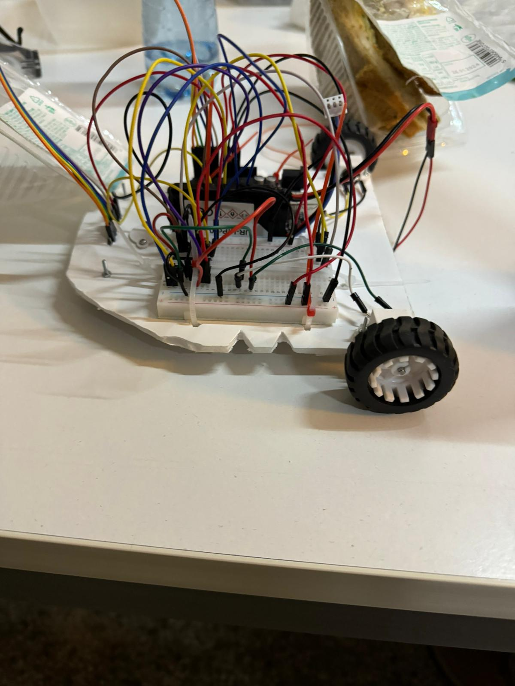

## Line Follower Robot Project

### Completion Date: January 20, 2024

### [Demonstration Video on YouTube](https://youtube.com/shorts/gY5rc7_6t-w?feature=share)

#### Project Overview

Design and build a line follower robot using an Arduino Uno and various components. The robot is programmed to follow a designated path, demonstrating basic robotics principles and sensor integration.

## Team Members

- Dobre Tiberiu-Gabriel
- Tintea Bogdan-Alexandru
- Virtopeanu Sebastian-Filip

## Key Components

- Arduino Uno
- QTR-8A Reflectance Sensor Array
- L293D Motor Driver
- DC Motors (2)
- Wheels (2)
- Breadboard - Medium (400pts)
- LiPo Battery (Power Source)
- Wires (Female-Male, Extra Wires)
- Ball Caster
- Chassis (Self-made from cardboard)
- Zip-ties
   
  

## Building Process

### Chassis Assembly

- Cutting and preparing the cardboard chassis.
- Mounting the ball caster.
- Installing the motors, Arduino, and breadboard on the chassis.
- Attaching the QTR-8A sensors in optimal positions for line tracking.
- Ensuring all components are securely fastened and wired correctly.

### Challenges in Assembly

- Calibrating the PID variables for precise movement control.
- Determining wheel turning strategies for navigating tight and dangerous curves.

### Sensor and Motor Integration

- Attaching and testing the QTR-8A sensor.
- Installing and testing the DC motors.

### Circuit Assembly

- Setting up the Arduino and breadboard.
- Wiring the sensors and motors to the L293D motor driver.

### Testing Phases

- Initial testing with straight line movement.
- Further testing on curved paths.
- Completing simple and complex circuit navigation.

## Performance Metrics

- Time to complete the circuit: 20.7 seconds

## Troubleshooting

- **Excessive Oscillation**: If the robot oscillates too much, consider adjusting the PID control variables. A lower proportional (P) value or a higher derivative (D) value might help stabilize the movement.

- **Overly Responsive to Curves**: If the robot responds too quickly to curves, causing erratic behavior or loss of track, try reducing the sensitivity of the steering mechanism. This can be achieved by fine-tuning the PID control values, particularly the proportional (P) and derivative (D) components.

- **Tips for Optimal Performance**:
  - Regularly calibrate the sensors to ensure accurate line tracking.
  - Test the robot in different lighting conditions to ensure consistent performance.
  - Ensure all connections are secure to prevent power or signal loss.
